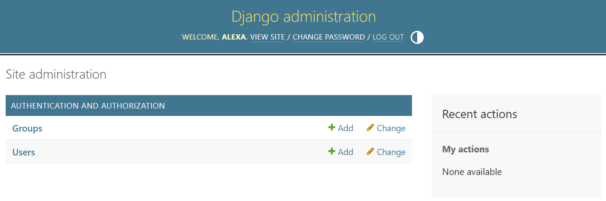

## ***Antes de começar...***<br>
... o que pode ser feito logo no inicio do projecto, imediatamente após criar o ambiente virtual - ```python -m venv .venv``` - e instalar o Django - ```pip install django``` - é definir um ficheiro de configurações para o ambiente de trabalho, para evitar ter que configurar o ambiente a cada nova sessão de trabalho. 

Um ficheiro de configurações, ou requisitos, contém as dependências do projecto, ou seja, os pacotes e as respectivas versões necessárias para o correcto funcionamento do projecto. 

Existem dois formatos de ficheiro de requisitos: 
- ```requirements.txt``` - formato mais simples, apenas lista os pacotes e as versões, sem informação adicional
- ```Pipfile``` - (extensão ```.toml```) formato mais avançado, inclui informação adicional como dependências de desenvolvimento, scripts de execução, etc.

Em ambos os casos, os ficheiros de requisitos podem ser criados para configurações distintas do ambiente de trabalho, e.g. desenvolvimento, testes, produção, etc.

Os ficheiros de requisitos são sempre colocados na raiz do projecto, ou seja, no mesmo nível do ficheiro ```manage.py```.

### Exemplos
#### requirements.txt
1. **Ficheiro base**, utilizável para desenvolvimento e produção, inclui as dependências principais do projecto:
```
    asgiref==3.11.1
    Django==5.2.14
    sqlparse==0.5.5
    tzdata==2026.2
    pyodbc
    python-dotenv==1.1.0
```
2. **Ficheiro de desenvolvimento**, inclui as dependências de desenvolvimento, e.g. ferramentas de teste, debug, etc.:
```
    -r requirements.txt
    pytest
    pytest-django
    behave==1.3.3
```
a linha inicial ```-r requirements.txt``` indica que as dependÊncias gerais são executadas antes das específicas, garantindo que o ambiente de desenvolvimento é coerente com o de produção. ***Não é necessário executar o ficheiro base***

3. O **ficheiro de requisitos pode ser gerado** a partir de um ambiente já preparado, utilizando o comando:
```
    [python -m] pip freeze > requirements.txt
```
4. Para **instalar as dependências** a partir de um ficheiro de requisitos, utilizar o comando:
```
    [python -m] pip install -r requirements.txt
```
Este comando deve ser executado sempre que haja alterações relevantes nas dependências do projecto - e.g. adição de um novo pacote, atualização de versão, etc. - ou sempre que se inicia um novo ambiente de trabalho.

#### Pipfile (.toml)
Por padrão, o ficheiro deve ter o nome ```pyproject.toml```
Por comparação com  o caso anterior, este formato não requer a criação de ficheiros distintos para cada configuração do ambiente de trabalho, existem secções específicas para cada tipo de dependências - e.g. ```[project]``` para dependências gerais, e ```[project.optional-dependencies]``` para dependências de opcionais - e podem ser utilizadas secções nominais para definir ambientes particulares - p.e. secção ```"dev"``` no exemplo abaixo para dependências de desenvolvimento.
1. **Ficheiro base**, utilizável para desenvolvimento e produção, inclui as dependências principais do projecto:
```
[build-system]
requires = ["setuptools>=68"]
build-backend = "setuptools.build_meta"

[project]
name = "biblioteca"
version = "0.1.0"
requires-python = ">=3.10"
dependencies = [
    "Django==5.2.14",
    "pyodbc",
    "python-dotenv==1.1.0"
]

[project.optional-dependencies]
dev = [
    "pytest",
    "pytest-django",
    "behave==1.3.3"
]
```
a secção ```[build-system]``` tem instruções para o processo de construção do projecto, indicando as dependências necessárias para a construção e o backend a utilizar. 

2. Para **instalar as dependências** a partir de um ficheiro de requisitos, utilizar um dos comandos:
   1. para instalar **apenas** as dependências gerais:
   ```
    [python -m] pip install -e .
   ```
   (atenção ao ponto - '.' no final que indica a localização do ficheiro de requisitos)
   
   ou
   ```
    [python -m] pip install -r pyproject.toml
   ```
   2. para instalar **todas** as dependências, incluindo as de desenvolvimento:
   ```
    python -m pip install -e ".[dev]"
    ```
    ou
    ```
    [python -m] pip install -r pyproject.toml[dev]
   ```

O formato ```pipfile``` é mais avançado e flexível, permitindo o uso de scripts de execução, definição de ambientes específicos, etc. Por outro lado, o formato ```requirements.txt``` é mais simples e amplamente utilizado, sendo suficiente para a maioria dos casos.
A escolha do formato a utilizar depende das necessidades do projecto, da dispersão e homogeneidade de ambientes onde venha ser utilizado, e da preferência pessoal.

## Parte III - Admin Site
- ponto prévio
  Caso ainda não tenha sido criado, definir admin/superuser
  No terminal, executar:

  ```python manage.py createsuperuser```

  O python irá solicitar nome de utilizador, email e palavra-passe, com confirmação.<br>
  Todos os campos são obrigatórios<br>
  Para testar a configuração, pode-se aceder ao site de administração em ```http://127.0.0.1:8000/admin``` e fazer login com as credenciais inseridas<br>
  
  Ajustar o endereço ao utilizado em ```runserver```</small>

### Criar uma classe personalizada 
- As classes/modelos são criadas em ```models.py``` dentro da pasta da App ('livros' no nosso exemplo):<br>
  Classe [Livro](.\biblioteca\livros\models.py)

  Elementos importantes na classe:
  1. ```models.«data type»``` indica tipo de dados do atributo
  2.  ```unique=True, primary_key=True``` indicam chave unica e chave primaria respectivamente
  3.  ```class Status(models.TextChoices):``` indica um tipo enumerado a utilizar como valores para um atributo da classe
    em ```SUGERIDO = 'S', 'Sugerido'```:<br>
    **SUGERIDO** indica o nome do valor;<br>
    **'S'** a chave de registo;<br> 
    **'Sugerido'** o valor do registo, utilizado para UI;<br>
  4. O valor enumerado é chamado por:
    ```
        status = models.CharField(
            max_length=1,
            choices=Status.choices,
            default=Status.DISPONIVEL,
        )
    ```
    onde:<br>
    ```status``` indica o nome do atributo;<br>
    ```max_length``` o tamanho <br>
    ```choices``` a lista de enumeração dos valores a utilizar - **Status**.choices. No exemplo, o nome do campo é igual ao da classe enumerada, mas isso não é obrigatório<br>
    ```default``` valor por defeito

  5. ```(default=timezone.now)``` define um valor por defeito para o atributo (neste caso, a data actual do sistema), caso um não seja indicado na inserção;
  6. ```Class Meta:``` define meta valores e comportamentos para a classe:
     1. ```ordering``` define ordenação padrão da lista a apresentar no UI padrão
     2. ```indexes``` define indices de ordenação da tabela 

### 'Migrar' o modelo para base de dados
Usando ORM, o python irá gerar a base de dados a partir dos modelos definidos para a App num processo semi-automático
1. gerar a migração:
```
python manage.py makemigrations livros
```
É gerado um ficheiro ```nnnn_«nome».py``` na pasta ```livros\migrations```<br>
O numero é incrementado a cada nova migração<br>
Não alterar nem apagar estes ficheiros, o python irá geri-los de acordo com as necessidades

2. validar o modelo de migração gerado
```
python manage.py sqlmigrate livros nnnn
```
3. aplicar a migração
```
python manage.py migrate
```
**Nota** este processo de migração tem que ser repetido a cada alteração relevante do modelo

### Registar a classe/***model*** na app de administração
Adicionar ao ficheiro ```livros\admin.py```:
```
from .models import Livro

@admin.register(Livro)
```
e adicionar uma vista personalizada para apresentação na página de administração
```
class LivroAdmin(admin.ModelAdmin):
    list_display = ('isbn', 'titulo', 'idioma', 'tipo', 'tema', 'editora', 'data_pub', 'original', 'status', 'data_add')
    search_fields = ('isbn', 'titulo')
    list_filter = ('tipo', 'tema', 'status')
    prepopulated_fields = {'tema': ('tipo',)}
```
onde:<br>
    ```list_display``` indica as colunas a apresentar, não tem que ser todos os atributos da classe<br>
    ```search_fields``` campos de pesquisa<br>
    ```list_filter``` campos ordenação<br>
    ```prepopulated_fields``` campos com preenchimento ligado, 'tema' é preenchido com valor de 'tipo', pode ser alterado<br>
Só neste ponto o site de administração apresentará a página de livros. No entanto, é necessário...

### Confirmar registo de URL de administração
Confirmar que na secção ```[urlpatterns]``` do ficheiro ```biblioteca\urls.py``` tem o registo:
```
path('admin/', admin.site.urls),
```
**ATENÇÃO** o registo é no ficheiro ```urls.py``` na root do projecto, não no da app

## Parte III multiplos objectos e views personalizadas

### Definir uma 2ª classe: editora
No ficheiro ```livro\models.py``` adicionar a classe [editora]:
```
class Editora(models.Model):
    nipc = models.CharField(max_length=9, unique=True, primary_key=True)
    nome = models.CharField(max_length=100)
    contacto = models.CharField(max_length=100)
    morada = models.CharField(max_length=200)
    class Meta:
        ordering = ['nipc']
        indexes = [
            models.Index(fields=['nipc']),
            models.Index(fields=['nome']),
        ]

    def __str__(self):
        return self.nome
```
### Adicionar FK de livro para editora
Ainda no mesmo ficheiro, alterar o atributo ```editora``` para:
```
editora = models.ForeignKey(Editora, to_field='nipc', on_delete=models.PROTECT)
```

### Actualizar as dependências para incluir a nova classe
De momento, o importante é actualizar o ficheiro ```admin.py``` para incluir a lista de editoras na interface de administração
Registar a classe:
```
@admin.register(Editora)
```
E definir a lista de tabela:
```
class EditoraAdmin(admin.ModelAdmin):
    list_display = ('nipc', 'nome', 'contacto', 'morada')
    search_fields = ('nipc', 'nome')
    list_filter = ('nome',)
```
**Nota**: não esquecer de actualizar o ***import*** de ```.models.py```

### Migrar...
Aceder à página de administração para validar que a estrutura de dados está correcta

### Parte IV - Views e templates
Criar uma view personalizada para a página de livros:
[views.py](.\biblioteca\livros\views.py)<br>
É necessário iportar a classe [Livros] para a view poder aceder à base de dados e apresentar os livros registados

O render da página pode gerar erro caso o dataset esteja vazio. Para evitar este erro pode-se adicionar uma view de especifica para este caso:
```Livro.existentes```

Criar um template para a página de livros:
[livros.html](.\biblioteca\livros\templates\livros\livros.html)
